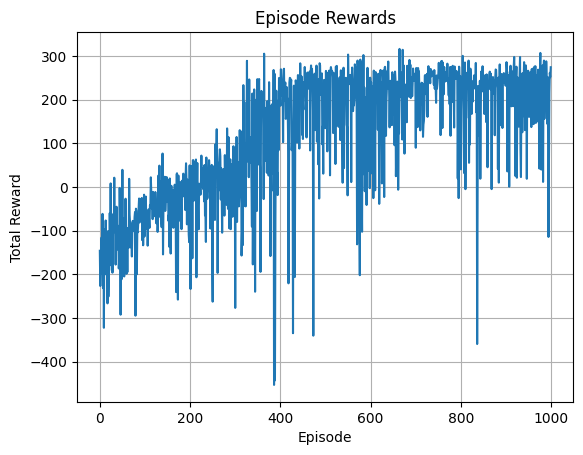

# Vanilla DQN on LunarLander-v2
```bash
This repository implements a **Vanilla Deep Q-Network (DQN)** agent to solve the
[LunarLander-v2](https://gym.openai.com/envs/LunarLander-v2/) environment from
OpenAI Gym using PyTorch.
```
---

## Project Overview
```bash

Reinforcement learning algorithms like DQN have revolutionized training agents to perform complex tasks by
learning action-value functions. This project focuses on a **vanilla DQN** implementation — the foundational
algorithm before enhancements like Double DQN or Dueling DQN.

> **Note:** This repository contains only the vanilla DQN. A separate repository will be dedicated to
Double DQN and its variants.

```
---

##  Repository Structure
```bash
    ├── dqn_lunarlander.py      # Main vanilla DQN training script
    ├── utils.py                # Helper functions for training and evaluation
    ├── demo_script.py          # Quick demo script to test the trained agent
    ├── demo.ipynb              # Interactive Jupyter notebook walkthrough
    ├── requirements.txt        # Python dependencies
    ├── README.md               # This file

```
---

## Getting Started
```bash
### 1. Install dependencies

    pip install -r requirements.txt

### 2. Train the agent
    python q_learning_tf.py

    . Use demo_script.py to test a trained agent quickly.
    . Explore demo.ipynb for an interactive walkthrough and analysis.

```
---

## Model Architecture
```bash

Dense(8 → 128) + relu
   ↓
Dense(128 → action_dim = 4)

. Optimizer: Adam (lr = 1e-3)
. Loss: nn.SmoothL1Loss()/hubber
. γ (discount factor): 0.99
. Epsilon decay: epsilon = max(epsilon_min, epsilon * epsilon_decay)

```
---
## Training Results
```bash
### Before Training
        . Average reward over 100 evaluation episodes: -823.34

### Training Progress (Sample Episodes)
        
        | Episode | Total Reward | Epsilon |
        | ------- | ------------ | ------- |
        | 0       | -146.18      | 0.995   |
        | 50      | 39.07        | 0.774   |
        | 100     | -93.15       | 0.603   |
        | 150     | -34.23       | 0.469   |
        | 200     | -96.90       | 0.365   |
        | 250     | -262.67      | 0.284   |
        | 300     | -276.93      | 0.221   |
        | 350     | 50.71        | 0.172   |
        | 400     | 185.57       | 0.134   |
        | 450     | 109.62       | 0.104   |
        | 500     | 134.55       | 0.081   |
        | 550     | 302.81       | 0.063   |
        | 600     | 225.33       | 0.049   |
        | 650     | 165.37       | 0.038   |
        | 700     | 89.62        | 0.030   |
        | 750     | 257.75       | 0.023   |
        | 800     | 40.15        | 0.018   |
        | 850     | 251.02       | 0.014   |
        | 900     | 249.13       | 0.011   |
        | 950     | 258.78       | 0.010   |

### After Training
        . Average reward over 100 evaluation episodes: 184.86
```
---

---
## How it Works (Brief)
```bash
    . The agent learns a Q-value function approximated by a neural network.
    . At each step, it chooses actions using an epsilon-greedy policy balancing exploration and exploitation.
    . Experience replay buffer stores past transitions for sampling during training.
    . A target network stabilizes training by providing fixed Q-targets updated periodically.
```
---

### Notes & Future Work
```bash
    . This is a vanilla DQN implementation — no Double DQN, Dueling Networks, or Prioritized Experience Replay.
    . A separate repository will implement and compare Double DQN to highlight performance improvements.
    . Improvements like gradient clipping, prioritized replay, and reward shaping can be experimented with.
    . Contributions and feedback are welcome!

```
---
