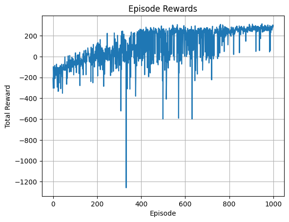

# Hybrid DQN Agent with Dueling Architecture, Double DQN & Prioritized Replay
```bash
This project implements a deep reinforcement learning agent that combines several advanced DQN variants:
    - Dueling Q-Network
    - Double DQN (decoupled action selection & evaluation)
    - Prioritized Experience Replay (TD-error-based sampling)

The agent is trained and evaluated on the LunarLander-v2 environment from OpenAI Gym.
```
---

## Highlights
```bash
- PyTorch-based implementation
- Clean, modular structure (agent, buffer, training loop)
- Tracks performance with average episode rewards
- Includes evaluation before and after training
```
---

##  Repository Structure
```bash
    ├── hybrid_dqn_lunarlander.py        # Main Double DQN with Prioritized Experience Replay training script
    ├── demo_scipt/train_agen.py         # Quick demo script to train and evaluate the agent
    ├── demo.ipynb                       # Interactive Jupyter notebook walkthrough for training from scratch
    ├── requirements.txt                 # Python dependencies
    ├── utils/evaluation.py              # Helper functions for training and evaluation
    ├── README.md                        # This file


```
---

## Getting Started

### 1. Install dependencies
```bash
    pip install -r requirements.txt

### 2. Train the agent

    . Use demo_script/train_agent.py to test a trained agent quickly.
    . Explore demo.ipynb for an interactive walkthrough and analysis.
    . Modify config in train_agent.py to tune hyperparameters
    . You can evaluate or render the trained agent via the evaluate_agent() utility

```
---

## Model Architecture
```bash

Dense(8 → 128) + relu
   ↓
Dense(128 → action_dim = 4)

. Optimizer: Adam (lr = 1e-3)
. Loss: nn.SmoothL1Loss()/hubber
. γ (discount factor): 0.99
. Epsilon decay: epsilon = max(epsilon_min, epsilon * epsilon_decay)

```
---
## Training Results
```bash
### Before Training
        . Average reward over 100 evaluation episodes: -261.84

### Training Progress (Sample Episodes)
        
        | Episode | Total Reward | Epsilon |
        | ------- | ------------ | ------- |
        | 0       | -207.67      | 0.995   |
        | 50      | -115.60      | 0.774   |
        | 100     | -83.12       | 0.603   |
        | 150     | -173.73      | 0.469   |
        | 200     | 93.10        | 0.365   |
        | 400     | 215.79       | 0.134   |
        | 600     | 219.92       | 0.049   |
        | 850     | 282.96       | 0.014   |
        | 950     | 234.53       | 0.010   |


### After Training
        . Average reward over 100 evaluation episodes: 237.38

```
---

---

## Model Performance Commentary
```bash
The hybrid DQN agent demonstrates significant improvements over baseline Deep Q-Learning algorithms in both
stability and final reward performance. Here's why this matters:

    . From -261.84 to +237.38 average reward: This jump represents a full behavioral shift — from frequent crashes
      and instability to consistent landings and goal achievement in LunarLander-v2.

    . Stable learning curve: Unlike vanilla DQN, which often exhibits oscillation and collapse due to
      overestimation bias and poor sample reuse, this hybrid model steadily converges thanks to:

        . Dueling networks refining state-value estimation
        . Double Q-learning reducing max-Q bias
        . PER accelerating useful sample exposure

    . Robust generalization: By the final stages of training (e.g. Episode 850–950), the agent consistently
      achieves rewards above 230+, indicating strong policy convergence and reliable decision-making.

    . Well-engineered architecture: The combined use of prioritized experience sampling, gradient clipping,
      and a decaying epsilon strategy supports efficient learning while maintaining numerical stability.
```
---

