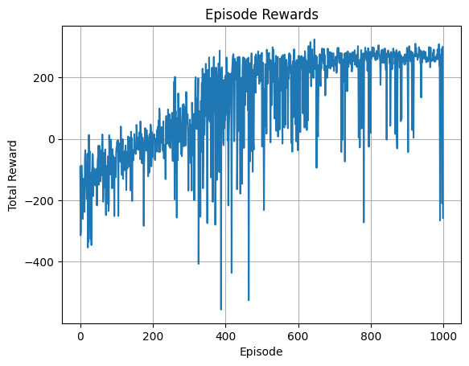

# Overview
```bash
Double DQN with PER improves training stability and sample efficiency by:

    . Double DQN: Decouples action selection and evaluation to reduce overestimation bias.

    . Prioritized Experience Replay: Samples important transitions more frequently, focusing
      learning on high-error experiences.

This approach yields faster and more stable learning compared to vanilla DQN.
```
---

##  Repository Structure
```bash
    ├── per_double_dqn_lunarlander.py    # Main Double DQN with Prioritized Experience Replay training script
    ├── demo.py                          # Quick demo script to train and evaluate the agent
    ├── demo.ipynb                       # Interactive Jupyter notebook walkthrough for training from scratch
    ├── requirements.txt                 # Python dependencies
    ├── utils.py                         # Helper functions for training and evaluation
    ├── README.md                        # This file


```
---

## Getting Started

### 1. Install dependencies
```bash
    pip install -r requirements.txt
```
### 2. Train the agent
```bash
    . Use demo_script.py to test a trained agent quickly.
    . Explore demo.ipynb for an interactive walkthrough and analysis.

```
---

## Model Architecture
```bash

Dense(8 → 128) + relu
   ↓
Dense(128 → action_dim = 4)

. Optimizer: Adam (lr = 1e-3)
. Loss: nn.SmoothL1Loss()/hubber
. γ (discount factor): 0.99
. Epsilon decay: epsilon = max(epsilon_min, epsilon * epsilon_decay)

```
---
## Training Results
```bash
### Before Training
        . Average reward over 100 evaluation episodes: -372.70

### Training Progress (Sample Episodes)
        
        | Episode | Total Reward | Epsilon |
        | ------- | ------------ | ------- |
        | 0       | -89.45       | 0.995   |
        | 50      | -22.02       | 0.774   |
        | 200     | -3.94        | 0.365   |
        | 400     | 206.42       | 0.134   |
        | 500     | 280.12       | 0.081   |
        | 700     | 254.69       | 0.030   |
        | 900     | 296.59       | 0.011   |
        | 950     | 259.91       | 0.010   |

### After Training
        . Average reward over 100 evaluation episodes: 238.37

```
---

---
## Model Performance Commentary
```bash
The PER-Double DQN implementation demonstrates significant learning progress on the LunarLander-v2 environment,
showcasing the strength of combining Double DQN with Prioritized Experience Replay.

    . Before training, the agent’s performance is understandably poor, with an average reward of
      around -373 over 100 episodes, indicating near-random behavior.

    . Throughout training, rewards steadily improve, with occasional dips that reflect the stochastic
      nature of the environment and exploration.

    . By episode 500, the agent starts consistently achieving positive rewards, breaking above 200 points,
      which signals a policy well beyond random or naive play.

    . After 1000 episodes, the average reward reaches approximately 238, a strong performance indicating the
      agent has learned an effective policy to safely land the lunar module.

This marked improvement highlights the efficacy of prioritized replay in focusing updates on important transitions,
and the Double DQN technique’s ability to mitigate overestimation bias — both crucial for stable and efficient
learning in continuous control tasks like LunarLander.
```
---
## Notes
```bash
    
    . The training uses a target network updated every 10 episodes to stabilize learning.

    . Epsilon-greedy policy decays epsilon gradually from 1.0 to 0.01.

    . Prioritized replay buffer uses alpha=0.6 and beta=0.4 for prioritization and importance sampling.
```
---

