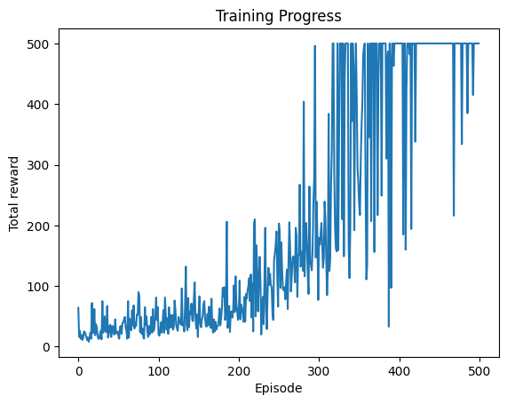

# Actor-Critic on CartPole-v1

```bash
This project implements a simple but effective **Actor-Critic reinforcement learning agent** to solve
the classic `CartPole-v1` environment from OpenAI Gym using TensorFlow.

It demonstrates how policy gradient methods can be combined with value estimation to create a stable
learning agent.
```
---

## Project Highlights

```bash
- Built from scratch using **TensorFlow 2.x** and **NumPy**
- Implements **on-policy actor-critic** using shared experience
- Modular code split into training, utilities, and demo scripts
- Includes **Jupyter Notebook** with explanations for interactive learning

---

##  Repository Structure

```bash
    actor_critic_cartpole/
        ├── ac_cartpole.py      # Main training script
        ├── demo_script.py      # Script to run a trained model
        ├── demo.ipynb          # Jupyter notebook version with markdowns
        ├── utils.py            # Helper functions (env handling, rollout, etc.)
        ├── requirements.txt    # Dependency list
        └── README.md           # You're here


```
---

## Getting Started

### 1. Install dependencies
```bash
    pip install -r requirements.txt
```
### 2. Train the agent
```bash
    . Use demo_script.py to test a trained agent quickly.
    . Explore demo.ipynb for an interactive walkthrough and analysis.

```
---

## Training Results

```bash
The agent was trained over **500 episodes**. Below is a snapshot of performance during training:
    

            | Episode | Reward | Actor Loss | Critic Loss |
            |--------:|-------:|-----------:|------------:|
            | 0       | 64.0   | -0.0015    | 1.4060      |
            | 250     | 203.0  | -0.0097    | 0.6789      |
            | 400     | 500.0  | -0.0273    | 0.6555      |
            | 450     | 500.0  |  0.0019    | 0.8129      |
            

- **Initial test average reward (100 episodes)**: `22.62`  
- **Final test average reward (100 episodes)**: `487.99`

The agent successfully learns to balance the pole and achieves near-perfect performance by the end of training.

```
---

---

## Algorithm

```bash
This is a basic **Actor-Critic** setup:
- **Actor**: A neural network that outputs a probability distribution over actions (left or right)
- **Critic**: A neural network that estimates the value of a given state
- Policy gradient is used to update the actor using **advantage estimates**
- Critic is updated using **Mean Squared Error loss** against discounted returns
```
---

