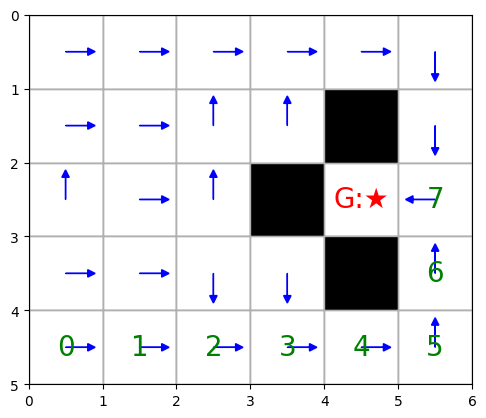

# Q-Learning in a Custom Gridworld 
```bash
This project implements **tabular Q-learning** in a custom Gridworld environment with obstacles and sparse rewards.

It showcases:
- An off-policy reinforcement learning algorithm (Q-learning)
- Epsilon-greedy exploration
- Custom state-transition logic with obstacle validation
- Text-based and matplotlib-based visualizations
- Path simulation from arbitrary start states
```

---

## Features
```bash
- Custom reward shaping
- Obstacles & invalid actions handled correctly
- Deterministic greedy policy execution
- Interactive visual output (grid + policy arrows)
- Modular design (agent, env, visualizations)
```
---

## File Structure
```bash
. agent.py – Q-learning agent logic
. environment.py – Gridworld environment with obstacles
. utils.py – Simulation, path planning, reward logic
. policy_plot.py – Arrows and matplotlib grid visualization
```

---

## Reward Structure
```bash

| Scenario           | Reward |
|--------------------|--------|
| Reaching the Goal  | `10.0`  |
| Any other step     | `-1.0` |
| Invalid/Blocked    | N/A (avoided through validation) |

Obstacles are treated as impassable and assigned a value of `-inf` in the state-value table.
```
---

## Sample Output (Greedy Policy Visualization)
```bash
Below is the printed policy learned by Q-Learning (arrows denote the best action in each cell):

Optimal Policy Grid (arrows indicate the best action in each cell):

      →     →     →     →     →     ↓   
      →     →     ↑     ↑     █     ↓   
      →     →     ↑     █     🏆     ←   
      →     →     ↓     ↓     █     ↑   
      →     →     →     →     →     ↑   


Optimal Policy Grid with rollout path from start state (⛳):

      →     →     →     →     →     ↓
      →     →     ↑     ↑     █     ↓
      ↑     →     ↑     █     🏆    7
      →     →     ↓     ↓     █     6
     ⛳     1     2     3     4     5


. →, ↑, ↓, ←: Optimal actions.

. █: Obstacles.

. 🏆: Goal state.

. ⛳: Start state.

Numbers indicate steps along the rollout path.

```
---

---
## Installation
```bash
    pip install -r requirements.txt
```
---

## Learn More
```bash
This project is great for:
 . Understanding Q-learning fundamentals
 . Experimenting with gridworld dynamics
 . Building intuition for value iteration & policies

```
---


