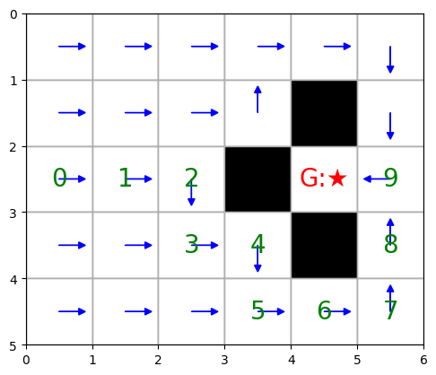

# Temporal Difference (TD(0)) Grid World
```bash
This project implements **Temporal-Difference (TD(0)) learning** in a 2D grid world environment with obstacles. The agent learns to estimate state values and follows a **greedy policy** derived from these learned values to reach a goal state while avoiding obstacles.

The project includes:
- TD(0) value learning from scratch
- Obstacles and movement constraints
- Greedy policy rollout
- Visual and symbolic rendering of the learned policy and value grid
```

---

## Features
```bash
- Value estimation using **TD(0)** algorithm
- Visual simulation of greedy policy
- Interactive grid world with:
  - Obstacles (`█`)
  - Goal state (`🏆`)
  - Agent's rollout path with step numbers
- Easy-to-extend codebase for experimenting with other RL algorithms
```

---

## Reward Structure
```bash

| Scenario           | Reward |
|--------------------|--------|
| Reaching the Goal  | `0.0`  |
| Any other step     | `-1.0` |
| Invalid/Blocked    | N/A (avoided through validation) |

Obstacles are treated as impassable and assigned a value of `-inf` in the state-value table.
```

---

## Sample Output (Greedy Policy Visualization)
```bash
Below is the printed policy learned by TD(0) (arrows denote the best action in each cell):

Optimal Policy Grid (arrows indicate the best action in each cell):

      →     →     →     →     →     ↓   
      →     →     ↑     ↑     █     ↓   
      →     →     ↑     █     🏆     ←   
      →     →     ↓     ↓     █     ↑   
      →     →     →     →     →     ↑   


Optimal Policy Grid with rollout path from start state (⛳):

      →     →     →      →     →     ↓
      →     →     →      ↑     █     ↓
     ⛳     ↓     ↓      █     🏆    9
      1     2     3      4     █     8
      →     →     →      5     6     7

. →, ↑, ↓, ←: Optimal actions.

. █: Obstacles.

. 🏆: Goal state.

. ⛳: Start state.

Numbers indicate steps along the rollout path.

```
---

---
## Installation
```bash

    pip install -r requirements.txt
```
---

## Usage
```bash
1. Run the demo script to see the optimal policy and a simulated path from a start state to the goal.

        python demo_script.py

2. Or explore the interactive Jupyter notebook:

        jupyter notebook demo.ipynb
```

---
